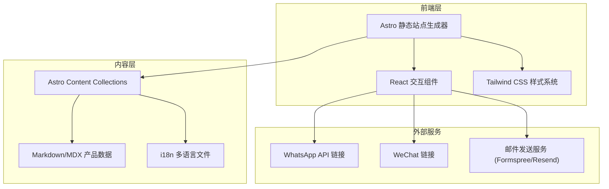
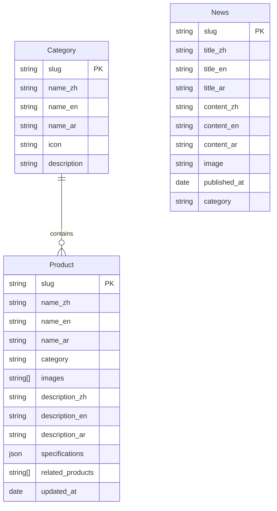

## 1. 架构设计



## 2. 技术说明

- **前端框架**：Astro@5 + React@18（交互组件）
- **样式方案**：Tailwind CSS@3 + CSS变量主题系统
- **初始化工具**：`npm create astro@latest`
- **后端**：无后端服务器（静态站点），询盘表单通过 Formspree/Resend 等第三方服务转发邮件
- **数据库**：无数据库，产品数据通过 Astro Content Collections（Markdown/MDX）管理
- **多语言方案**：Astro i18n 路由 + JSON 翻译文件
- **部署方案**：Vercel / Netlify（静态站点托管，支持SSG）
- **即时聊天**：WhatsApp/WeChat 外部链接浮窗组件

## 3. 路由定义

| 路由 | 用途 |
|------|------|
| `/` | 首页 - 品牌展示、产品导航、核心优势 |
| `/products` | 产品中心 - 产品分类筛选与列表 |
| `/products/[slug]` | 产品详情 - 单个产品完整信息 |
| `/about` | 关于我们 - 公司介绍、历程、资质、工厂 |
| `/contact` | 联系我们 - 询盘表单与联系方式 |
| `/news` | 新闻资讯 - 新闻列表 |
| `/news/[slug]` | 新闻详情 - 单篇新闻内容 |
| `/en/*` | 英文版对应页面 |
| `/ar/*` | 阿拉伯文版对应页面（RTL布局） |

## 4. API定义

无自建后端API。外部服务集成：

### 4.1 询盘表单提交

- **服务**：Formspree / Resend
- **请求**：POST 表单数据（姓名、邮箱、国家、公司、产品兴趣、消息）
- **响应**：成功/失败状态，前端显示Toast提示

### 4.2 即时聊天

- **WhatsApp**：`https://wa.me/{号码}?text={预填消息}`
- **WeChat**：显示微信号/二维码弹窗

## 5. 服务器架构图

不适用（纯静态站点，无自建服务器）

## 6. 数据模型

### 6.1 数据模型定义



### 6.2 数据定义

产品数据以 Markdown/MDX 文件存储在 `src/content/products/` 目录下，通过 Astro Content Collections 管理：

```
src/content/
  products/
    yzy260-hydraulic-oil-press.md
    yzy320-hydraulic-oil-press.md
    spiral-oil-press-6yl-95.md
    oil-refining-equipment.md
    oil-filter-press.md
    seed-pretreatment-line.md
    complete-oil-production-line.md
    ...
  categories/
    hydraulic-oil-press.md
    spiral-oil-press.md
    refining-equipment.md
    filtering-equipment.md
    pretreatment-equipment.md
    complete-production-line.md
    ...
  news/
    company-attends-exhibition.md
    new-product-launch.md
    ...
```

每个产品 Markdown 文件包含 frontmatter 元数据 + 正文描述：

```yaml
---
title:
  zh: "液压榨油机 YZY260"
  en: "Hydraulic Oil Press YZY260"
  ar: "مكبس زيت هيدروليكي YZY260"
category: "hydraulic-oil-press"
model: "YZY260"
images:
  - "/images/products/yzy260-1.jpg"
  - "/images/products/yzy260-2.jpg"
specifications:
  - name: "处理量"
    value: "8-12 kg/次"
  - name: "工作压力"
    value: "40-50 MPa"
  - name: "电机功率"
    value: "2.2 kW"
  - name: "整机重量"
    value: "950 kg"
  - name: "外形尺寸"
    value: "1200x800x1500 mm"
related:
  - "yzy320-hydraulic-oil-press"
  - "oil-filter-press"
updatedAt: 2026-06-01
---
```

多语言翻译文件存储在 `src/i18n/` 目录：

```
src/i18n/
  zh.json
  en.json
  ar.json
```
